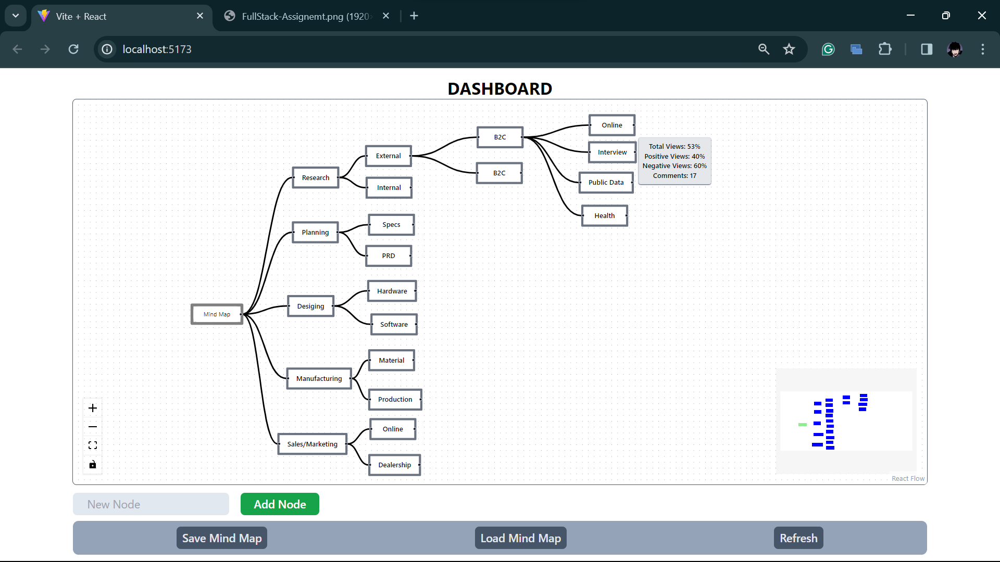

## Mind Mapping App - Visualize Your Ideas

This project offers a user-friendly web application for creating interactive mind maps. Leverage the power of visual representation to organize your thoughts, brainstorm ideas, and plan projects effectively.

**Live Demo:**

Explore the application live at [here](https://mind-mappingapp007.netlify.app/)

**Key Features:**

* **Create Custom Nodes:** Represent your ideas using customizable nodes. Each node can hold text, images, or other data types.
* **Connect Nodes:** Establish relationships between your ideas by dragging connections between nodes.
* **Interactive Node Graph:** Pan, zoom, and navigate through your mind map with ease using intuitive controls.
* **Save Mind Map:** You can save your current design in your Browser's Local storage and retrieve it later.
* **Clean and Intuitive Interface:** The user interface is designed for clarity and ease of use, allowing you to focus on your ideas.

**Visual**


**Getting Started:**

No installation is required! Simply access the provided link and start creating your mind map.
Or you can clone the repository and run the command:

```npm install```

**Future Development:**

This project is under continuous development. Future plans include:

* Enhanced node customization options (e.g., colours, shapes)
* Collaboration features for real-time brainstorming
* Exporting mind maps to different formats

**Technologies Used:**

* React
* React Flow

**Feedback:**

We appreciate your feedback! Feel free to report any issues or suggest improvements through the project's issue tracker (link, if applicable).


**धन्यवाद (Thank You)**

